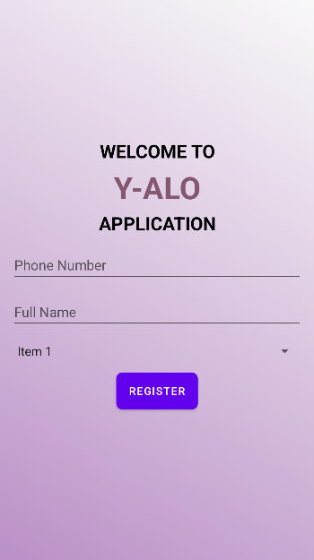
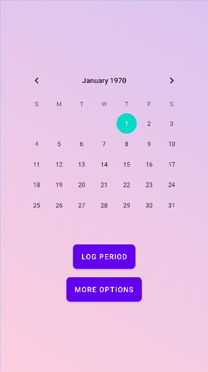
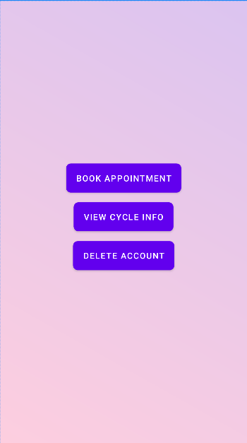

<h1 align="center">Y-ALO: AI Infused Dynamic Menstrual Cycle Tracking System :curly_loop:</h1>

## Overview
The Y-ALO Tracker app is a comprehensive period tracking application developed using Android Studio with Kotlin. It allows users to manage their menstrual health efficiently by providing features such as account creation, period logging, cycle analysis, appointment booking, and more. The app integrates advanced machine learning algorithms and AI-powered health assistance, making it a valuable tool for women.

## Test
To ensure the seamless functionality of Y-ALO's chatbot integration with various messaging platforms, we have provided the QR code for Telegram below. The rest requires a developer's account to access. This allows you to easily verify and interact with the chatbot. Simply scan the QR code using your Telegram app to get started.

## Features
- Account Creation: Users can create an account by entering their name and phone number from either app or any of the integrated chatbots, which is then stored in Firebase Realtime Database.
- Period Logging: Log the date of the first period in the calendar. The data is processed for in-depth analysis of previous cycles.
- Cycle Analysis: View detailed analysis of previous period cycles to understand patterns and trends.
- Appointment Booking: Book health-related appointments directly through the app.
- Account Management: Option to delete the account if needed.
- Chatbot Integration: Integrated with multiple chatbots connected to messaging apps like Messenger, Telegram, Instagram, and WhatsApp. More integrations in the future could include Line and Viber as well.
- Dual Language Input: Supports input in multiple languages for better accessibility.
- Advanced ML Algorithm: Uses machine learning to predict the next period date accurately. Users only need to log their name and period duration only once.
- Notifications: Sends notifications 3 days before and 24 hours before the next period date. 
- AI Health Assistance: Ask questions related to feminine health and get highly accurate answers from the integrated AI.
- Data Handling: All data is securely stored in Firebase Realtime Database from both the messaging apps and the main application.

# Getting Started
## Prerequisites
- Android Studio
- Kotlin
- Firebase Realtime Database
- Botpress Account

## Installation
1. `git clone https://github.com/nehlinshanila/hackathon.git`

2. *Open the project in Android Studio:*
  - Launch Android Studio.
  - Open the cloned project.

3. *Set up Firebase*:
  -Go to the Firebase Console.
  - Create a new project or use an existing one.
  - Add your Android app to the Firebase project.
  - Download the google-services.json file and place it in the app directory of your project.
  - Follow the Firebase setup instructions to configure Firebase Realtime Database.

3. *Run the App:*
  - Connect an Android device or use an emulator.
  - Click on the "Run" button in Android Studio.

4. *Run the Bots:*
   -Import the .bpz file to botpress studio

## Usage
1. ### Create an Account:
  - Open the app and enter your name and phone number to create an account.
2. ### Log Period Date:
  - Log the date of your first period in the calendar.
3. ### View Cycle Analysis:
  - Check the analysis of your previous period cycles.
4. ### Book Appointments:
  - Use the app to book health-related appointments.
5. ### Receive Notifications:
  - Get notified 3 days before and 24 hours before your next period date.
6. ### Ask Health Questions:
  - Ask the integrated AI questions related to feminine health and get accurate answers.
7. ### Use Chatbots:
  - Interact with the app via chatbots on Messenger, Telegram, Instagram, and WhatsApp.

## Contributing
1. Fork the repository.
2. Create a new branch (git checkout -b feature-branch).
3. Make your changes.
4. Commit your changes (git commit -m 'Add some feature').
5. Push to the branch (git push origin feature-branch).
6. Create a new Pull Request.

Thank you for using the Y-ALO Tracker app!

